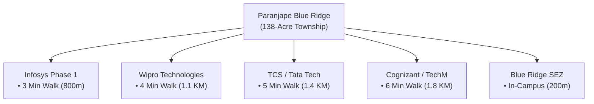

# The Walk-to-Work IT Corridor Lifestyle: Hinjewadi Phase 1 Rajiv Gandhi Infotech Park Living

In major Indian metropolitan hubs like Bengaluru, Mumbai, and Hyderabad, the average IT professional loses between **2 to 3 hours every day** sitting in bumper-to-bumper traffic. Over a career spanning 20 years, that equates to more than **15,000 hours** sacrificed to transit fatigue, fuel expenses, and elevated stress.

In Western Pune, **Hinjewadi Phase 1** presents a revolutionary urban antidote: **The True Walk-to-Work Integrated Lifestyle**.

At the epicentre of this transformation is **[Paranjape Blue Ridge](/paranjape-blue-ridge-hinjewadi-pune)**, a 138-acre township built specifically to eliminate the friction of daily commutes while delivering an ultra-luxury gated living experience.

---

## 1. The Proximity Matrix: Tech Giants at Your Doorstep

Unlike residential projects located in peripheral Phase 2, Phase 3, or distant suburban outskirts, Paranjape Blue Ridge enjoys an unparalleled **Phase 1 prime gateway location**:

| Tech Campus / Corporate Park | Distance from Blue Ridge | Walking Time | Driving Time |
| :--- | :--- | :--- | :--- |
| **Blue Ridge IT SEZ (In-Campus)** | 200 Meters | **2 Minutes** | 0 Minutes |
| **Infosys Phase 1 Campus** | 800 Meters | **3 Minutes** | 2 Minutes |
| **Wipro Technologies** | 1.1 KM | **4 Minutes** | 3 Minutes |
| **TCS & Tata Technologies** | 1.4 KM | **5 Minutes** | 4 Minutes |
| **Cognizant Technologies** | 1.8 KM | **6 Minutes** | 5 Minutes |
| **Embassy TechZone** | 2.6 KM | 10 Minutes | 7 Minutes |
| **Quadron Business Park** | 2.8 KM | 11 Minutes | 8 Minutes |

---

## 2. Health, Family & Psychological Dividends of Zero-Commute Living

Eliminating 2 hours of daily traffic congestion delivers measurable dividends across mental well-being, family life, and physical health:

1. **Reclaimed Family Time**: Parents are home by 6:00 PM for dinner, children's homework, and leisure activities at the township clubhouse.
2. **Fitness & Recreation**: Morning jogs along the Mula riverfront promenade or a 9-hole golf session before heading to the office.
3. **In-Campus ICSE Schooling**: Children attending the [Blue Ridge Public School](/paranjape-blue-ridge-hinjewadi-pune) walk to school within the protected, vehicular-segregated campus gates, eliminating school bus safety concerns.
4. **Financial Savings**: Eliminating car commute saves an estimated ₹12,000 to ₹18,000 per month in fuel, wear-and-tear, and cab fares.

---

## 3. Social Infrastructure & Weekend Life in Hinjewadi Phase 1

Living at Blue Ridge means never needing to leave your neighbourhood for daily essentials, gourmet dining, or sports:

### Inside the 138-Acre Gates:
- **Blue Ridge Boat Club**: Kayaking, rowing, and waterside cafe culture on the Mula River.
- **Golf Academy**: 9-hole executive course with floodlit putting greens.
- **High-Street Retail & Convenience**: Supermarkets, medical pharmacies, salons, banks, ATMs, and multi-cuisine cafes operational on-site.
- **Sports Arenas**: Full-size football field, tennis academy, squash courts, and temperature-controlled swimming pools.

### Immediate Neighborhood Access:
- **Dining & Social**: Mezza9, The Orchid Hotel, Courtyard by Marriott, High Street dining within 5–10 minutes.
- **Healthcare**: Ruby Hall Clinic Hinjewadi (1.5 KM), Sanjeevani Hospital, and Lifepoint Multispecialty Hospital.
- **Transit Connectivity**: 800 meters from the upcoming Hinjewadi Metro Line 3 station and direct 12-minute access to Balewadi High Street via the new river corridor bridge.

---

## 4. Housing Options for Every Career Stage

Whether you are an incoming software developer, a senior project manager, or an executive leader, Blue Ridge offers tailored configurations:

1. **[Ridges 41](/paranjape-blue-ridge-41-hinjewadi-pune)**: 2 & 3 BHK MiVAN Smart Homes starting at ₹97.60 L* — ideal for young tech professionals seeking high rental yields and low initial down payment.
2. **[Promenade Residences](/paranjape-blue-ridge-promenade-hinjewadi-pune)**: 3 & 4 BHK luxury residences in Hinjewadi’s tallest residential tower — perfect for growing families.
3. **[The Altius](/paranjape-blue-ridge-the-altius-hinjewadi-pune)**: Ultra-luxury 4 & 5 BHK river-facing suites with private lift lobbies and panoramic golf course vistas.

---

## Conclusion

The walk-to-work lifestyle is no longer a luxury—it is the essential standard for sustainable, modern living. By residing at **Paranjape Blue Ridge Hinjewadi Phase 1**, professionals replace traffic stress with riverside tranquility and unmatched community living.

*Explore available configurations and schedule an executive site tour by calling **+91-20-67210000**.*
