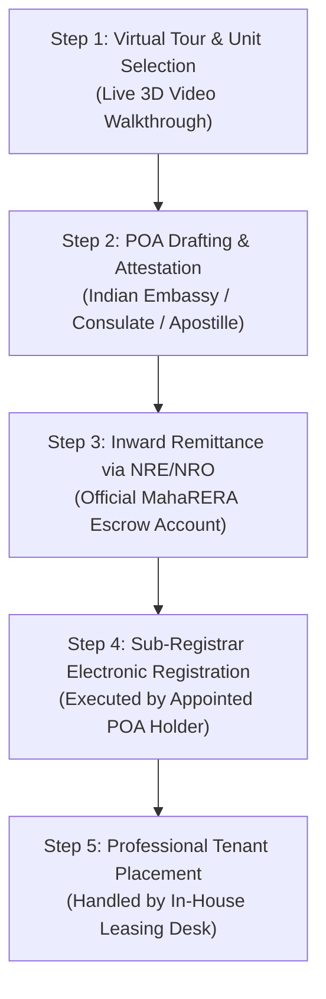

# NRI Real Estate Investment Guide for Pune (2026): FEMA, Tax Laws & 5% Rental Yields

For Non-Resident Indians (NRIs) and Overseas Citizens of India (OCIs) based in the United States, United Kingdom, UAE, Singapore, Canada, and Australia, Indian real estate represents one of the world's most compelling wealth creation and capital preservation asset classes.

With the Indian rupee currency dynamics, stable economic expansion exceeding 6.8% GDP, and strict regulatory enforcement by **MahaRERA**, investing in high-growth tech corridors like **Pune West (Hinjewadi Phase 1)** delivers exceptional dividend yields and long-term currency-hedged growth.

This comprehensive guide details the legal, financial, tax, and property selection criteria for overseas investors acquiring property in **[Paranjape Blue Ridge](/paranjape-blue-ridge-hinjewadi-pune)**.

---

## 1. Legal Framework: FEMA & RBI Regulations for NRIs

Under the **Foreign Exchange Management Act (FEMA)** guidelines issued by the Reserve Bank of India (RBI):

| Key FEMA Parameter | RBI Regulation for NRIs / OCIs |
| :--- | :--- |
| **Eligibility** | Any NRI (holding an Indian passport) or OCI can purchase unlimited residential and commercial properties in India. |
| **Restrictions** | NRIs/OCIs cannot purchase agricultural land, plantation property, or farmhouses without special RBI approval. |
| **Banking Channels** | All property payments must be executed via inward remittances through normal banking channels using **NRE** or **NRO** accounts. Cash payments or traveler's cheques are strictly prohibited. |
| **Repatriation of Capital** | Sale proceeds from up to **two residential properties** can be repatriated outside India in foreign currency without RBI clearance, subject to tax compliance. |

---

## 2. Step-by-Step Purchase Process via Power of Attorney (POA)

NRIs do not need to travel to India to execute property bookings, registrations, or leasing agreements. The entire acquisition is executed via a registered **Special Power of Attorney (POA)**:

1. **Unit Selection & Booking**: Select specific unit floor plans in [Promenade Residences](/paranjape-blue-ridge-promenade-hinjewadi-pune) or [Ridges 41](/paranjape-blue-ridge-41-hinjewadi-pune) via high-definition virtual tours and CAD layouts.
2. **Drafting the Power of Attorney**: The POA document is drafted specifying limited powers to execute builder-buyer agreements, sign registration deeds, and manage tenant leases.
3. **Embassy Attestation / Apostillization**: The NRI signs the POA before the Indian Consulate/Embassy in their country of residence, or gets it apostilled under the Hague Convention.
4. **Adjudication in India**: The original POA is adjudicated at the District Registrar’s office in Pune by the appointed representative.
5. **Registration & Key Handover**: The POA holder executes the registered agreement for sale at the Sub-Registrar office.

---

## 3. Taxation Framework for NRIs (Rental Income & Capital Gains)

### A. Rental Income Taxation (TDS & DTAA)
- Rental income earned from Indian real estate is taxable under the head *"Income from House Property"*.
- **Standard Deduction**: A flat **30% deduction** is permitted on gross annual rent for maintenance and repairs, regardless of actual expenses.
- **Home Loan Interest**: Up to **₹2,00,000** deduction under Section 24(b) on home loan interest.
- **Double Tax Avoidance Agreement (DTAA)**: India has DTAA treaties with 85+ countries (US, UK, UAE, Singapore, Australia). Taxes paid in India can be claimed as a tax credit against tax liabilities in your country of residence, eliminating double taxation.

### B. Long-Term Capital Gains (LTCG)
- Real estate held for more than **24 months** is categorized as a Long-Term Capital Asset.
- LTCG is taxed at **12.5%** (post Budget 2024 revisions).
- Capital gains can be completely exempted under **Section 54** by reinvesting the proceeds into another residential property in India within 2 years.

---

## 4. Why Global NRIs Choose Paranjape Blue Ridge Hinjewadi

1. **4.8% – 5.2% Rental Yield**: With over 450,000 corporate IT employees working in Hinjewadi Phase 1, units in Blue Ridge experience less than **15 days vacancy** between tenant transitions.
2. **Turnkey Corporate Tenants**: High-earning software architects and multinational executives (Infosys, TCS, Wipro, Cognizant) provide reliable, direct-debit monthly rental remittances.
3. **35-Year Developer Heritage**: Built by [Paranjape Schemes (Construction) Ltd.](/paranjape-blue-ridge-hinjewadi-pune), with 200+ delivered projects and 100% legal clarity under MahaRERA.
4. **Dedicated NRI Relationship Desk**: Complete assistance with PAN card generation, NRE account opening, POA adjudication, and property tax management.

---

## 5. Currency Arbitrage & Appreciation Potential

| Target Currency | 5-Year Depreciation against INR | Net Effective Annual Return (CAGR) |
| :--- | :--- | :--- |
| **USD ($)** | ~3.0% – 3.5% | **11.5% – 13.0% (INR Terms)** |
| **AED (Dirham)** | Pegged to USD | **12.0% – 13.5%** |
| **GBP (£)** | ~2.5% – 3.0% | **11.0% – 12.5%** |
| **SGD ($)** | ~2.0% – 2.5% | **12.5% – 14.0%** |

---

## Conclusion & NRI Priority Consultation

For overseas Indians seeking a secure, high-yield, professionally managed real estate asset in India’s leading technology capital, **Paranjape Blue Ridge Hinjewadi** delivers unmatched returns, lifestyle heritage, and complete peace of mind.

*Connect directly with the **Sovereign NRI Advisory Desk** via WhatsApp at **+91-7744009295** or email **nri-desk@paranjapeblueridge.com** for a customized portfolio consultation and NRI tax briefing.*
