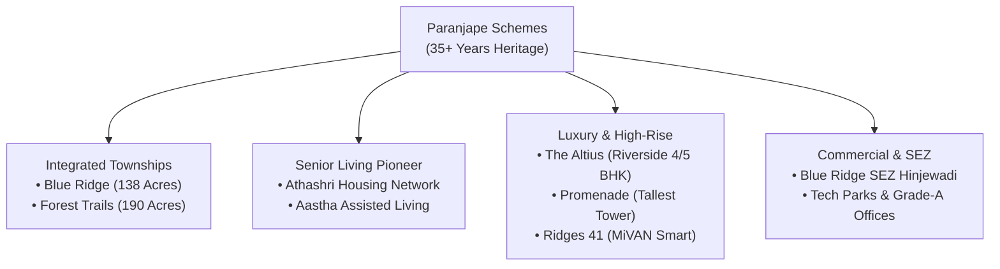

# Paranjape Schemes: 35+ Years of Heritage, 200+ Delivered Projects & MahaRERA Governance

In the Indian real estate landscape, trust is not built through advertising campaigns—it is forged over decades through structural delivery, engineering precision, and uncompromising legal compliance.

For over three and a half decades, **Paranjape Schemes (Construction) Ltd. (PSCL)** has stood as one of Maharashtra’s most revered, pioneering real estate developers. With a portfolio encompassing **200+ delivered landmark projects**, over **20 million square feet of completed developments**, and a thriving community of **75,000+ happy residents**, Paranjape Schemes represents the gold standard of real estate credibility in Pune, Mumbai, Bangalore, and international hubs.

---

## 1. The Heritage & Vision of Paranjape Schemes

Founded in 1987 by visionary pioneers **Mr. Shrikant Paranjape** and **Mr. Shashank Paranjape**, the company revolutionized urban housing by shifting the focus from simple concrete structures to holistic, community-centric ecosystems.

### Core Milestones in the 35+ Year Legacy:
- **1987–1995**: Pioneered premium redevelopment and boutique residential housing in prime Pune localities (Deccan Gymkhana, Prabhat Road, Model Colony, Kothrud).
- **2000**: Conceptualized and launched **Athashri**, India’s very first dedicated senior living housing model, which went on to win international acclaim for geriatric care and age-friendly architecture.
- **2008**: Launched **[Paranjape Blue Ridge](/paranjape-blue-ridge-hinjewadi-pune)** in Hinjewadi Phase 1—a monumental 138-acre integrated mega-township that transformed the IT corridor from barren farmland into a world-class live-work-play destination.
- **2015–2020**: Expanded into mega-townships with **Forest Trails** (Bhugaon, 190 Acres) and modern high-rise engineering marvels.
- **2026 & Beyond**: Pioneering sustainable green townships, ultra-luxury high-rises (41-storey towers), and smart integrated infrastructure powered by MiVAN monolithic engineering.

---

## 2. Iconic Portfolio & Brand Pillars

### A. Integrated Townships
Paranjape Schemes is one of the rare developers globally capable of master-planning, executing, and managing self-contained integrated mini-cities. Blue Ridge Hinjewadi contains its own:
- 9-Hole Golf Course
- Private River Boat Club
- ICSE Blue Ridge Public School
- Captive 220/22 KVA Power Substation
- Water and Sewage Treatment Plants with Zero Discharge

### B. Athashri — India's Premier Senior Living Network
Long before senior living became a recognized real estate category in India, Paranjape Schemes recognized the need for specialized housing for seniors. Athashri provides doctor-on-call, anti-skid flooring, specialized nutrition, community activities, and emergency response systems across multiple locations in Pune, Bangalore, and beyond.

---

## 3. Engineering Precision & MiVAN Monolithic Construction

Paranjape Schemes continues to lead technical innovation in structural engineering. In projects like **[Ridges 41](/paranjape-blue-ridge-41-hinjewadi-pune)** and **[Promenade Residences](/paranjape-blue-ridge-promenade-hinjewadi-pune)**, advanced **MiVAN (Aluminium Formwork) monolithic casting technology** is deployed:

1. **Monolithic Concrete Strength**: Walls and slabs are poured concurrently in high-grade RCC, creating seamless, earthquake-resistant monolithic structures.
2. **Zero Seepage & Crack Resistance**: Smooth concrete finishes eliminate the structural joints of conventional brick masonry, preventing water ingress and dampness.
3. **Carpet Area Optimization**: Perfectly plumb and slim RCC shear walls result in a net **3% to 5% increase in usable carpet area** compared to thick brick walls.
4. **Rapid Execution**: Standardized floor cycles ensure rapid delivery without compromising on material curing and safety.

---

## 4. MahaRERA Governance & Legal Sovereignty

In an era where regulatory transparency is paramount, Paranjape Schemes operates under full compliance with Maharashtra Real Estate Regulatory Authority (MahaRERA) mandates:

- **100% Escrow Account Discipline**: Every rupee collected from homebuyers is routed through designated bank escrow accounts dedicated exclusively to the project's construction costs.
- **RERA Certified Title Deeds**: Clear, unencumbered land titles verified by leading legal counsels.
- **Transparent Specifications**: Clear demarcation of RERA Carpet Area with zero ambiguity on common area loading.

| Project Name | Cluster Type | MahaRERA Registration Number | Current Status |
| :--- | :--- | :--- | :--- |
| **Promenade Residences** | Luxury High-Rise & Riverfront | **P52100055581** | Under Construction |
| **Ridges 41** | 41-Storey MiVAN Smart Homes | **P52100000054** | Under Construction |
| **The Altius** | Ultra-Luxury 4 & 5 BHK River Suites | **P52100000054** | Premium Inventory |

---

## 5. Why Homebuyers Choose Paranjape Schemes

1. **Timely Delivery Track Record**: 200+ completed projects over 35 years prove execution capability through multiple market cycles.
2. **Resale Value & Capital Appreciation**: Homes built by Paranjape Schemes consistently command the highest resale valuations in Pune due to strong construction quality and township maintenance.
3. **Vibrant Resident Communities**: Over 75,000 residents enjoy year-round cultural festivals, sports tournaments, and active resident welfare associations.

*Experience the legacy firsthand by visiting the **Paranjape Blue Ridge Sovereign Sales Gallery** in Hinjewadi Phase 1 or connecting with our senior advisory desk at **+91-20-67210000**.*
