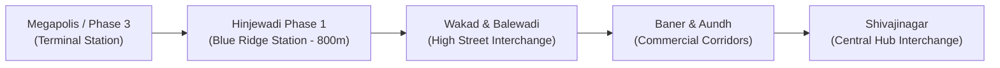

# Pune Metro Line 3 Station Map & Real Estate Impact: The Hinjewadi-Shivajinagar Surge

The **Pune Metro Line 3** (elevated 23.3 KM corridor connecting Hinjewadi Phase 1 to Shivajinagar) is the single most consequential public transit project in Pune’s contemporary history. 

Connecting Western Pune's booming IT hub directly to the city’s historic central business district via 23 state-of-the-art elevated stations, Metro Line 3 is fundamentally reorganizing real estate valuations, commute patterns, and tenant demographics across the entire western urban corridor.

For homeowners and real estate investors in **[Paranjape Blue Ridge](/paranjape-blue-ridge-hinjewadi-pune)**, located just **800 metres** from the Hinjewadi gateway station, understanding the timeline, station alignment, and financial impact is crucial.

---

## 1. Technical Overview: Pune Metro Line 3 Corridor



| Key Project Metric | Details / Specifications |
| :--- | :--- |
| **Total Corridor Length** | 23.28 Kilometres |
| **Total Number of Stations** | 23 Elevated Stations |
| **Key Terminals** | Megapolis (Hinjewadi Phase 3) ⇄ Civil Court / Shivajinagar |
| **End-to-End Travel Time** | **~32 Minutes** (Down from 90–120 mins by car during peak hours) |
| **Interchange Junctions** | Direct connectivity to Line 1 (PCMC-Swargate) and Line 2 (Vanaz-Ramwadi) at Civil Court |
| **Proximity to Blue Ridge** | **800 Meters** (Walking distance under 7 minutes) |

---

## 2. Complete 23-Station Line Map Alignment

The 23 stations are systematically divided into four strategic catchment zones:

### Zone 1: Hinjewadi IT Cluster (Phase 1 to Phase 3)
1. Megapolis Circle (Phase 3)
2. Embassy TechZone
3. Quadron Business Park
4. Infosys Phase 2
5. Wipro Circle
6. **Hinjewadi Phase 1 Gateway Station (Serving Paranjape Blue Ridge)**
7. Wakad Flyover Junction

### Zone 2: Western Residential & Retail Core
8. Balewadi Stadium
9. Balewadi High Street
10. Baner Gaon
11. Baner Phata
12. Krushi Bhavan

### Zone 3: Aundh & University Transit Belt
13. Sakal Nagar
14. Savitribai Phule Pune University
15. RBI Colony
16. Government Polytechnic
17. College of Agriculture

### Zone 4: Central Business District & Multimodal Hub
18. Shivajinagar Junction
19. Civil Court (Multi-Line Interchange)

---

## 3. Financial & Valuation Surge: The 1-Kilometer Station Radius Rule

Across international transit studies (Delhi Metro, London Crossrail, Singapore MRT), residential properties situated within a **500m to 1.2 KM radius** of high-speed rapid transit stations experience three distinct stages of capital value appreciation:

```
[Phase 1: Construction Announcement] -> +5% to +8%
[Phase 2: Viaduct & Physical Station Completion] -> +12% to +18%  <-- WE ARE HERE (2026)
[Phase 3: Commercial Revenue Operation] -> +20% to +30% Total Appreciation
```

### Why the 800-Meter Distance to Blue Ridge is Optimal:
1. **Zero Noise & Dust**: Being 800m away insulates residential towers from the vehicular idling, bus queues, and acoustic friction directly under transit terminals.
2. **Effortless Pedestrian Access**: A clean 7-minute walk across wide, dedicated pedestrian walkways brings residents to the ticket gates.
3. **Rental Liquidity Multiplier**: Opens Blue Ridge to tenants working in Aundh, Baner, and Central Pune who previously avoided Hinjewadi due to traffic bottlenecks.

---

## 4. Rent vs Travel Time Comparison for IT Professionals

| Origin / Residence | Destination (Central Pune) | Current Transit (Car/Cab) | Metro Line 3 Transit | Time Saved Daily |
| :--- | :--- | :--- | :--- | :--- |
| **Paranjape Blue Ridge** | Shivajinagar CBD | 75 – 90 Minutes | **32 Minutes** | **~100 Minutes** |
| **Paranjape Blue Ridge** | Pune University | 60 – 75 Minutes | **24 Minutes** | **~85 Minutes** |
| **Paranjape Blue Ridge** | Balewadi High Street | 25 – 35 Minutes | **10 Minutes** | **~40 Minutes** |

---

## 5. Strategic Investment Takeaways for 2026

1. **Lock In Pre-Operation Pricing**: Current inventory in [Ridges 41](/paranjape-blue-ridge-41-hinjewadi-pune) and [Promenade Residences](/paranjape-blue-ridge-promenade-hinjewadi-pune) is priced before full revenue operations commence.
2. **Yield Expansion**: Expect rental yields in Hinjewadi Phase 1 to expand from the current 4.8% up toward **5.5%** as addressable tenant demand doubles.
3. **Liquid Exit Horizons**: Rapid transit connectivity transforms high-rise apartments into the most liquid resale assets in Pune's residential marketplace.

*For an interactive station alignment briefing and current cost sheets, connect with the **Paranjape Blue Ridge Sovereign Sales Team** at **+91-20-67210000** or schedule an on-site consultation.*
