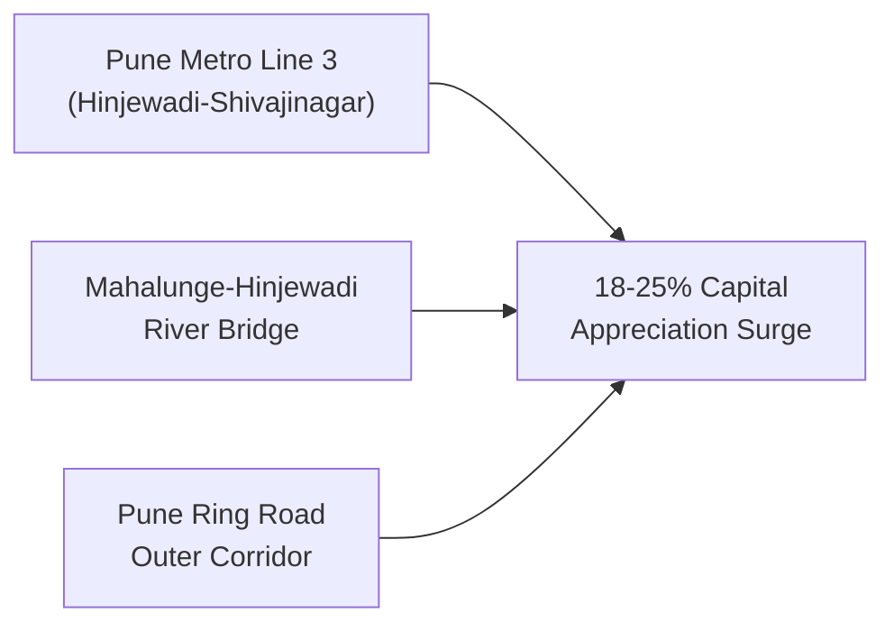

# Pune Real Estate Investment Master Guide (2026-2030): Western Corridors, Yields & Growth

The **Pune real estate market** has evolved into one of India’s most resilient, lucrative, and fundamentally sound property investment destinations. Driven by a robust $35B+ IT & biotechnology ecosystem, world-class automotive engineering belts, and premier educational institutions, Pune consistently commands top tier rental absorption and sustainable capital appreciation.

As institutional capital, domestic HNIs, and NRI investors position their portfolios for the **2026–2030 investment cycle**, Western Pune—anchored by **Hinjewadi Phase 1, Baner, Balewadi, Wakad, and Mahalunge**—stands as the definitive growth engine.

---

## 1. Macro-Economic Fundamentals of Pune Real Estate

Unlike speculative real estate markets driven purely by investor flipping, Pune’s property ecosystem is underpinned by genuine end-user absorption and massive employment creation:

| Macro Indicator | Metric / Trend | Economic Impact on Real Estate |
| :--- | :--- | :--- |
| **IT/ITeS Workforce** | 450,000+ Professionals | Continuous influx of high-earning young tech talent requiring rental & ready homes. |
| **Annual Rental Yield** | 4.2% – 5.2% (Western Pune) | 2x higher than Mumbai (2.2%) and Delhi NCR (2.8%), delivering superior cash flow. |
| **Capital Appreciation CAGR** | 10.5% – 12.8% (3-Year Average) | Driven by physical infrastructure upgrades and Grade-A integrated township demand. |
| **MahaRERA Compliance** | Strict State Governance | 100% project transparency, escrow-backed construction, and zero risk of stalled builds. |

---

## 2. Micro-Market Ranking: Western Pune Corridor Breakdown

Investors evaluating West Pune must analyze micro-markets based on commute friction, social infrastructure, and capital upside:

### A. Hinjewadi Phase 1 — The Undisputed Capital of High-Yield Real Estate
- **Profile**: Home to the Rajiv Gandhi Infotech Park (Infosys, Wipro, TCS, Tech Mahindra, Cognizant) and the 138-acre [Paranjape Blue Ridge](/paranjape-blue-ridge-hinjewadi-pune) integrated township.
- **Rental Yield**: **4.8% – 5.2%** (Highest in Western India).
- **Price Range**: ₹9,500 – ₹13,200 per sq. ft.
- **Primary Catalysts**: Walk-to-work lifestyle, Pune Metro Line 3 operational status, captive ICSE schools, and private riverfront amenities.
- **Top Pick**: [Ridges 41](/paranjape-blue-ridge-41-hinjewadi-pune) (Smart high-rise 2 & 3 BHKs) and [Promenade Residences](/paranjape-blue-ridge-promenade-hinjewadi-pune) (Riverfront luxury).

### B. Baner & Balewadi — High-Street Luxury & Commercial Hub
- **Profile**: The lifestyle and dining capital of Pune West, adjacent to Mumbai-Bangalore Highway (NH-48).
- **Rental Yield**: 3.2% – 3.8%.
- **Price Range**: ₹12,500 – ₹17,000 per sq. ft.
- **Primary Catalysts**: Balewadi High Street commercial leases, upscale retail, proximity to Hinjewadi tech parks via upcoming transit flyovers.

### C. Wakad & Mahalunge — High-Density Residential Expansion
- **Profile**: Rapidly densifying residential catchment connecting Hinjewadi to the expressway.
- **Rental Yield**: 3.8% – 4.2%.
- **Price Range**: ₹8,500 – ₹10,800 per sq. ft.
- **Consideration**: High concentration of standalone buildings leading to traffic congestion, elevating the premium of self-contained townships like Blue Ridge.

---

## 3. The 3 Mega Infrastructure Catalysts (2026–2030)

1. **Pune Metro Line 3 (Hinjewadi to Shivajinagar)**:
   - Spanning 23.3 KM across 23 elevated stations, this transit line slashes commute times between Hinjewadi Phase 1 and Central Pune from 90 minutes to under 32 minutes.
   - Properties within 1 KM of stations (including Paranjape Blue Ridge, situated just 800m away) historically experience a **15% to 25% valuation leap** upon commercial commissioning.

2. **Mahalunge-Hinjewadi Bridge & Road Expansion**:
   - Creates a seamless multi-lane link across the Mula River, connecting Hinjewadi Phase 1 directly to Baner and Balewadi, removing the Wakad bottleneck entirely.

3. **Pune Ring Road (128 KM Outer Expressway)**:
   - Redirects heavy interstate transit around Pune’s periphery, boosting logistics connectivity to Mumbai, Bengaluru, and the proposed Purandar International Airport.

---

## 4. Why Integrated Townships Outperform Standalone Buildings

In a post-pandemic, work-from-home/hybrid era, modern homebuyers and multinational corporate tenants actively reject standalone buildings lacking internal infrastructure. 

A self-contained 138-acre mega-township like **[Paranjape Blue Ridge](/paranjape-blue-ridge-hinjewadi-pune)** provides a complete lifestyle ecosystem that commands a **20–30% rental and capital premium**:
- **In-Campus ICSE School**: Blue Ridge Public School allows children to walk to school in 3 minutes with zero road traffic.
- **Sports & Wellness**: Private 9-hole golf course, private boat club on the Mula river, Olympic-size swimming pools, and dedicated tennis courts.
- **Power & Water Sovereignty**: Captive 220/22 KVA power substation ensuring zero blackouts, paired with dedicated Water Treatment Plants (WTP) and Sewage Treatment Plants (STP).
- **Commercial SEZ**: On-site tech park allowing residents to literally walk to their office desk in 2 minutes.

---

## 5. Strategic Investment Recommendations for 2026–2030

| Investor Profile | Recommended Allocation | Projected 5-Year Return |
| :--- | :--- | :--- |
| **First-Time Investor / Yield Seeker** | 2 BHK Smart Home in [Ridges 41](/paranjape-blue-ridge-41-hinjewadi-pune) (Entry: ₹97.60 L*) | **5.0% Annual Cash Flow** + 12% CAGR Capital Growth |
| **Upgrader / Senior Tech Executive** | 3 BHK Riverfront in [Promenade Residences](/paranjape-blue-ridge-promenade-hinjewadi-pune) | **High Corporate Lease Liquidity** + Rapid Capital Appreciation |
| **Ultra-HNI / Luxury Collector** | 4 & 5 BHK River-Facing in [The Altius](/paranjape-blue-ridge-the-altius-hinjewadi-pune) | **Trophy Waterfront Asset** with Unmatched Scarcity Value |
| **NRI / Global Indian Investor** | Multi-Unit 2 BHK Portfolio with POA Leasing Support | **Forex-Hedged High Real Estate Growth** in Pune Tech Corridor |

---

## Conclusion

The window between **2026 and 2028** represents the optimal entry point for Pune real estate investment before Pune Metro Line 3 reaches full commercial capacity. By anchoring capital in legally clear, MahaRERA-certified, infrastructure-rich integrated townships like **Paranjape Blue Ridge Hinjewadi**, investors secure the highest yield-to-risk ratio in India’s residential sector.

*To schedule a private site visit or receive the 2026 Master Cost Sheet & Floor Plan dossier, contact the Sovereign Sales Gallery at **+91-20-67210000** or via [online enquiry](/).*
